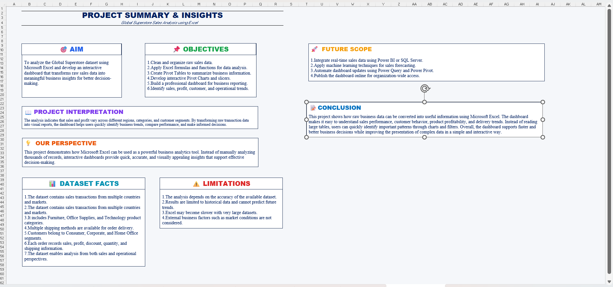
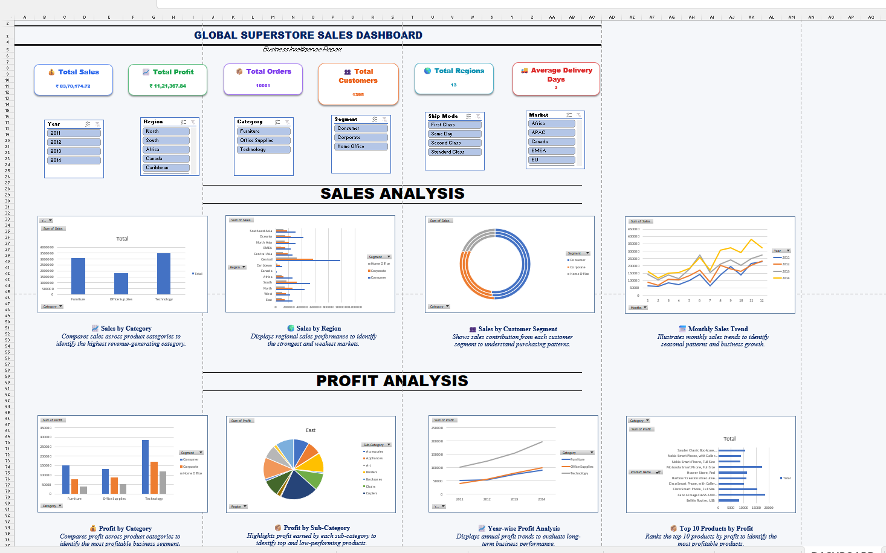

# Global Superstore Sales Analytics

## Project Overview

This project is part of the Excel module of my Data Science & Analytics course. The project uses the Global Superstore dataset to perform data cleaning, analysis, and visualization using Microsoft Excel.

## Objective

The objective of this project is to analyze sales and profit data using Excel functions and features, create meaningful visualizations, and develop an interactive dashboard to generate useful business insights.

## Dataset

- Dataset: Global Superstore
- Records: 10,001
- Variables: 24
- Source: Kaggle

## Excel Features Used

- Data Cleaning
- Excel Tables
- Excel Functions
- Sorting & Filtering
- Conditional Formatting
- Data Validation
- PivotTables
- PivotCharts
- Slicers
- Dashboard & Visualizations

## Project Screenshots

### Project Summary

### Final Dashboard

## Tools Used

- Microsoft Excel 2021

## Project File

[Download Excel Project](Global_Superstore_Excel_Analytics.xlsx)

## Project Status

Completed
